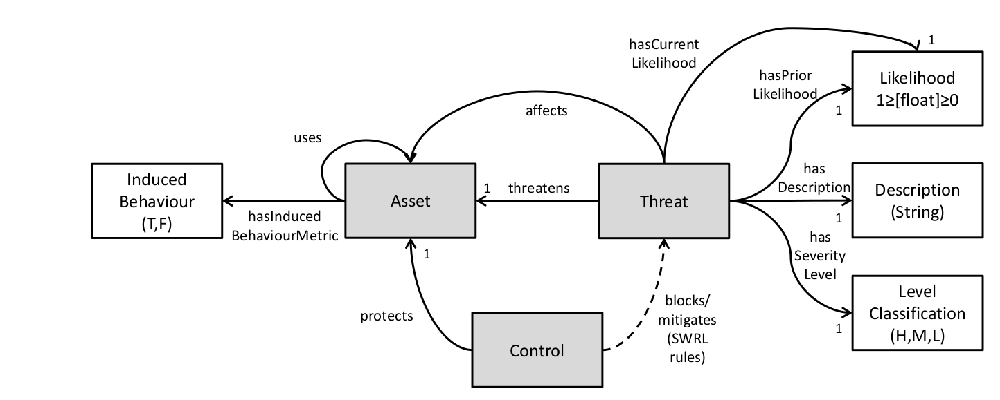

# The story of the Spyderisk Open Project

Last updated April 2024

This document ([HISTORY.md](./HISTORY.md)) was first written quarter-way
through the 21st century, where humanity faces problems of immense complexity.
Many citizens worry they cannot escape the effects of automated systems, and
there are quite rightly responses to these feelings by governments and others in society.
Spyderisk is one response to this, a tool intended to visualise and present a summary 
of the risk in systems too complicated for any human to understand or debug.

# Contents

* [The journey to openness](#the-journey-to-openness)
* [Threat modelling in cyber-physical systems](#threat-modelling-in-cyber-physical-systems)
* [Evolving the modelling implementation](#evolving-the-modelling-implementation)
* [Much larger systems, and notions of compliance](#much-larger-systems,-and-notions-of-compliance)
* [Trust modelling in sociotechnical systems](#trust-modelling-in-sociotechnical-systems)
* [The role of ontologies, and Spyderisk papers](#the-role-of-ontologies,-and-spyderisk-papers)

# The journey to openness

Our Spyderisk story starts in 2006 at the University of Southampton in England,
where a group gathered themselves under the name 
[IT Innovation Centre](https://www.it-innovation.soton.ac.uk/) and
successfully bid for research funding to solve problems related to complex
computer systems. Starting with GRID computing and then leading on to security,
privacy, health data and bioinformatics, the Centre kept investing in software
tools for assessing the risk in complex systems. And while software always gets
out of date, even more importantly the Centre developed a database of knowledge
about risk assessment.

It became clear that risk assessment is being taken seriously throughout
society. From legislation
[regulating the use of AI in our daily lives](https://www.europarl.europa.eu/topics/en/article/20230601STO93804/eu-ai-act-first-regulation-on-artificial-intelligence),
to the need to [balance conflicting requirements for climate change](https://doi.org/10.1038/s44168-023-00078-x),
there is a strong desire to understand what sorts of risks are involved. And while it seems
counter-intuitive that we can make judgements about risks even without
understanding how these complex systems work, that does seem to be true. 

The IT Innovation Centre realised that it had 15 years of study that could be
used to seed a new community of automated risk assessment. 

In 2023 the Spyderisk open project was founded, with the IT Innovation team
aiming for involvement and practical applications far beyond Southampton.  All
the software tools and databases were published to the world under open
licences, together with [copies of all academic output](./docs/papers/README.md).

Spyderisk is a collaborative effort and we [invite anyone interested in contributing](./CONTRIBUTING.md)
to this field to join in. The rest of this document explains how we got here,
but you might prefer to start with the [general project introduction](./README.md).
There have been many [contributors so far](./CONTRIBUTORS.md) and we look forward to 
welcoming many more.

# Threat modelling in cyber-physical systems

Engineer and mathematician [Mike Surridge](https://www.southampton.ac.uk/people/5wyvsw/professor-mike-surridge#research) 
lead a team developing concepts in [grid computing](https://en.wikipedia.org/wiki/Grid_computing). 
[Michael Boniface](https://www.southampton.ac.uk/wsi/about/staff/mb.page) and others implemented the
[GRIA distributed computing system](https://web.archive.org/web/20110726132409/http:/www.gria.org/),
and presented an early paper on
[semantic risk management tools for adaptive security](./docs/papers/boniface2010.pdf). GRIA was open source,
and it demonstrated that assessing risk in a dynamic computer system is a difficult problem. 

In 2009 Ajay Chakravarthy implemented security models in the
[Semantic Web Rule Language (SWRL)](https://protege.stanford.edu/conference/2009/slides/SWRL2009ProtegeConference.pdf)
to create the first version of the Spyderisk System Modeller reasoner. The introduction 
of semantic web approaches brought with it a need for an [ontology](https://en.wikipedia.org/wiki/Ontology_(information_science)),
which is a formal description of knowledge. An ontology defines objects and the relationships between objects.
This was the beginning of the Spyderisk knowledgebase.

So far, all of the co-operating systems involved were other computer systems,
and if something went wrong in the end it was always possible to restart the
compute workloads. Then we started to consider systems with direct impacts on
the real world, where restarting is not an option. This is in the area of
[cyber-physical systems](https://en.wikipedia.org/wiki/Cyber-physical_system).

>  Mike and the team observed that the level of risk between multiple
   cyber-physical systems increases with their connectivity - even if
   the intention of the connectivity is to share information to reduce risk.

This was really not what was expected with increased information sharing.

This work lead to a 2010 EU project to design a system to examine data flows between
[organisations in the air transport industry](./docs/papers/surridge2010.pdf), which is a 
complex always-on network where restarts are not possible. The industry had been increasing
connectivity between air traffic control and the airport operators, which we showed 
caused the opposite of what was intended - risk increased, and the chances of smooth operations
reduced.

# Evolving the modelling implementation

For the first time, the group developed interactive software to visualise
relationships and risk.  The implementation used stochastic methods derived from
[Markov queuing theory](https://en.wikipedia.org/wiki/Markovian_arrival_process) to explore
how the objects and relationships defined in the knowledgebase could express risk over the whole 
system, depending on the likelihood of various chains of events occurring.
We used our demonstration system to present a [followup 2011 paper](./docs/papers/surridge2011.pdf)
where we compared the stochastic method to
[discrete simulation](https://en.wikipedia.org/wiki/Discrete-event_simulation) and concluded that our 
modelling approach gave results that could be very useful in the real world.

Everything until this point was in the field of [Secure Systems Modelling](./docs/papers/surridge2011-1.pdf),
that is, secure IT systems which impact on the physical world such as covered in the 
[ISO2700 series](https://en.wikipedia.org/wiki/ISO/IEC_27000-series).  We learned how
to effectively model dependencies in the tree of risks, observing that just one
change in risk (for example, a problem being fixed) can result in a very
different and sometimes surprising change in the overall risk assessment after
recalculation. We concluded that ISO27000-type approaches are unsuitable
for unpredictable and unstable systems of systems such as are found in the commercial
airline industry.

Our knowledgebase was starting to become a useful applied tool, as we said in 2011:

> Improvements to the core ontology (below) allow us to
  model physical and electronic attacks on airport connectivity and spaces.
  These include the ability of actors (including intruders) to move around the
  airport, the use of private networks to support communications with and in the
  airport, and the potential for physical or electronic attacks on communication
  assets as well as services that use them.

Over time, as we refined our software tools, we began to move towards
cause-and-effect modelling as opposed to probabilistic modelling.  Spyderisk
today uses fuzzy logic and inference to determine how likely it is that
different threats and their consequences may occur, based on the different
fuzzy inference rules that describe what can happen in a given system. These
fuzzy rules are based in Bayesian probability and allow Spyderisk to perform
efficient risk assessments based on the approximate fuzzy information that is
typically available in cyber-physical systems.

# Much larger systems, and notions of compliance

Mobile telephone networks are highly regulated just like the airline industry, 
because they are safety-critical. Similarly with anything to do with handling health
data, and as we delivered risk assessment solutions for these industries we began to
consider compliance. 

>  A key insight was viewing compliance requirements as threats,
   which then meant our one modelling approach could capture the
   security and safety aspects of an entire system of systems. 

The ICT systems used in mobile networks are exceedingly complicated, as we
discovered in a [2018 project modelling threats in 5G networks](./docs/papers/surridge2018). 
There can be hundreds of different computer systems
involved from unrelated companies, and many stakeholders - not least the
individual end users.  A threat to one stakeholder requires responses from
other stakeholders because no one stakeholder has all power or rights. We
cannot know all the details of the individual industries, which is why we made
Spyderisk modelling more accessible. We need more experts in specific domains
to assist with developing new models, as we experienced again when delivering
a [2019 project for sharing health data](./docs/papers/surridge2019), and another as part 
of the [RESTASSURED Secure Cloud Data Processing](https://cordis.europa.eu/project/id/731678) project.

These projects in 2019 led to the first modern versions of the system modeller
(or ssm, now called simply "Spyderisk".) With our approach of treating
non-compliance as a threat, we were able to model privacy in terms of the EU
GDPR for the first time, helping healthcare providers assess their data
handling processes.

Our deliverables for the EU [FogProtect project](https://fogprotect.eu/) in
[2020](./docs/papers/surridge2020.pdf) and [2022](./docs/papers/taylor2022.pdf)
addressed the security and risk management of systems spanning the cloud and
[fog](https://en.wikipedia.org/wiki/Fog_computing), where there could be many
fog nodes to handle. For this the system modeller was enhanced to efficiently
handle large numbers of assets through treating them as distributions of
behaviours and considering the important cases, which were: the average
behaviour of the population, the behaviour of the best member, and the
behaviour of the worst member.

# Trust modelling in sociotechnical systems

So far we had mostly dealt with aspects of security in cyberphysical systems.
The problem with a cyber-physical approach is that it tends to be less
concerned with the complexities of the humans who interact (or choose not to
interact) with the systems. Over time we broadened our approach, as concerns
increased in society generally. This involves more nuanced and subtle questions
related to humans and how they feel, including:

* trust - do groups of people feel this system is one they want to use and recommend?
* privacy - this is a complex intersection of facts and law, and intimate feelings of violation
* safety - how does a system meet safety requirements, and does it also make people feel safe?

In 2019 we explored this more [human view of health data risks](./docs/papers/pickering2019) from a psychological perspective.

At a policy level (that is, the things that governments and large organisations
in society are concerned with) we are seeing laws that talk about "Trustworthy
systems" and "Responsible AI". Spyderisk is interested in how to assess
concepts of trust and responsibility, because not only does nobody fully
understand the systems these terms are applied to, but they also involve
aspects of psychology and sociology. For example, a system may be objectively
safe in a technical sense, but people could still have good reasons not to
trust it, which may well cause other problems. All of this can be associated
with harms, and thus Spyderisk can potentially assess the likelihood of these harms occurring.

We want Spyderisk to become increasingly good at modelling these systems,
visually present the harms to users, and demonstrate what happens as the user
changes the model for different scenarios.

# The role of ontologies, and Spyderisk papers

Since 2009 Spyderisk has based its reasoning about risk on an underlying ontology. Ontologists often
distinguish between three general types of ontologies:

* Upper-Level/Foundational Ontologies (e.g., [Basic Formal Ontology](https://basic-formal-ontology.org/) for information retrieval and analysis)
* Reference/Core/Mid-Level/Domain Ontologies (e.g., [Reference Ontology for Security Engineering [ROSE]](https://purl.org/security-ontology), [Common Core Cyber Ontology [C3O]](https://opensource.ieee.org/cyber-ontology-working-group/cyber-ontology-releases))
* Application-Level (with knowledge of particular details, e.g. a statement that a "Server" may contain "Data" and some of that could be "Personal Data")

Spyderisk combines a domain ontology with an application-level ontology, but
does not have an upper-level ontology. The Spyderisk ontology continues to be
developed, and research specifically aimed at improving ontologies in various
Spyderisk applications and domains. Since 2023 the team has collaborated on
three papers related to ontological challenges in Spyderisk:

* [Secure Ontologies for Internet of Things Systems (SOfIoTS)](./docs/papers/smart2023.pdf) 
* [Biomedical Burden Ontology: Ontology Documentation](./docs/papers/smart2024.pdf) 
* [The Ethics of the Extended Mind: Mental Privacy, Manipulation and Agency](./docs/papers/smart2024-2.pdf)

