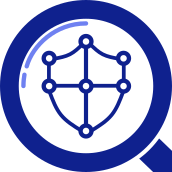

# Open Project Strategy

## Introduction

This document defines the strategy for the [Spyderisk Open Project](https://github.com/Spyderisk) defining the vision, aims and strategic objectives. The strategy aims to:

* communicate openly to collaborators what we are aiming to achieve.
* provide structure, steering and guidance to collaborator activities and decision making.
* monitor progress against our strategic objectives for all stakeholders.

## Vision

A world of trustworthy socio-technical systems responsibly designed, developed and operated using open, effective, and accessible risk assessment:

* socio-technical systems come with standardised risk assessment models describing trustworthiness assumptions and security controls.
* system developers and users compose risk assessment models using Spyderisk methods, knowledge and tools to carry out risk assessment.
* tools are fast and easy to use, and their output is reproducible and explainable.
* tools and risk knowledge are co-produced by the community reflecting input from all stakeholders.

## Aim

The Spyderisk Open Project aims to revolutionise understanding of the trustworthiness of socio-technical systems by establishing an international Open Community supporting the research, development, use and support of open, effective, and accessible risk assessment methods, knowledge and tools.  

## Strategic objectives

1. Make risk assessment of socio-technical systems reliable, open and accessible to all as a public good, free and easy to use.
2. Foster a diverse and inclusive community of users and contributors who offer a meaningful voice and language for socio-technical risk assessment that reflects this diversity.
3. Openly share, curate and engineer published machine-readable and explainable knowledge describing socio-technical risks and their causes, effects and controls to manage them.
4. Develop effective risk assessment methods and tooling, including alternative implementations, co-produced and used by the community to tackle existing and emerging socio-technical risks.
5. Ensure project stewardship is conducted openly by diverse and representative stakeholders for the benefit of communities.

