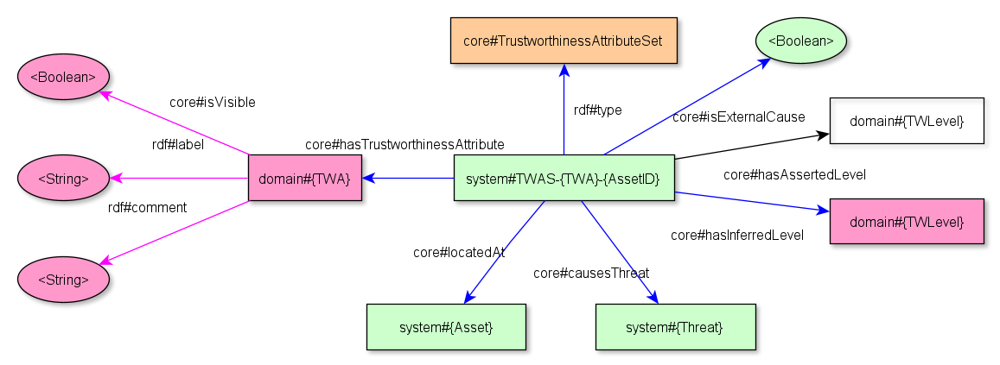

Describes version FIXME of the [Spyderisk core model](https://github.com/Spyderisk/system-modeller/blob/dev/src/main/resources/core.rdf).

This document is not strictly limited to the core, because it also covers some things needed for system modelling.

Includes notes on versions FIXME-FIXME of the core model

# Introduction

This document aims to describe how we represent various aspects of the
models in the Triplestore. It originates from personal notes by Mike Surridge.

This document is very much incomplete and a work in progress.

# Notation

The diagrams directly show the models as represented in the Triplestore.
A triple (subject, predicate, object) is shown on the diagram as two
things linked by an arrow. The things and the arrows are labelled with
abbreviated forms of the URIs:

-   core#something →\
    http://it-innovation.soton.ac.uk/ontologies/trustworthiness/core#something

-   domain#something →\
    http://it-innovation.soton.ac.uk/ontologies/trustworthiness/domain#something

-   system#something →\
    http://it-innovation.soton.ac.uk/ontologies/trustworthiness/system#something

-   rdf#type →\
    http://www.w3.org/1999/02/22-rdf-syntax-ns#type

-   rdf#label →\
    http://www.w3.org/2000/01/rdf-schema#label

-   rdf#comment →\
    http://www.w3.org/2000/01/rdf-schema#comment

-   \<Boolean\> → a literal Boolean, e.g.
    \"true\"\^\^http://www.w3.org/2001/XMLSchema#boolean

-   \<Integer\> → a literal Integer, e.g.
    \"4853\"\^\^\<http://www.w3.org/2001/XMLSchema#integer\>

-   \<String\> → a literal String

The fragment identifiers of the URIs are (in the system model) sometimes
constructed from various strings. For instance, a trustworthiness
attribute set URI may be "system#TWAS-Authenticity-2aaa4816" where
"Authenticity" is the trustworthiness attribute and "2aaa4816" is the ID
of the asset object. To show how different URIs relate, these URIs are
written as templates with variable interpolation, such as
"system#TWAS-{TWA}-{AssetID}", meaning replace "{TWA}" with the actual
trustworthiness attribute name and replace "{AssetID}" with the actual
asset ID.

Triples in the inferred graph are shown with blue arrows and those in
the system graph are shown with black arrows.

The different elements are coloured according to:

-   System URI: green

-   Core URI: orange

-   Domain URI: pink

White boxes/ovals are asserted (and should also have black arrows).

Need to indicate what is added by validator and what is added by risk
calculation.

Rectangles are entities, and ovals are literals/attributes.

# System Model

## Asserted Asset

When the user adds an Asset to the canvas, they are asserting the
existence and type. They may choose to change the default population
size (singleton) and may choose to change the default label. The Java
service adds the AssetID and this also goes in the asserted graph.

-   Asset: the asset URI fragment (a Java object hash for asserted
    assets or something constructed including AssetIDs for inferred
    assets)

-   AssetID: the ID of an asset (8 hex digits)

-   AssetType: the asset type (e.g. "Data")

-   PopulationSize: e.g. "PopLevelSingleton"

## Inferred Asset

An inferred Asset has the same triples but in the inferred graph.

## Asset Relations / Cardinality Constraint

-   rdf#type: core#CardinalityConstraint

-   core#linkType: domain#{relationID}

-   core#linksFrom: system#{AssetID}

-   core#linksTo: system#{AssetID}

-   core#sourceCardinality: Integer

-   core#targetCardinality: Integer

## Trustworthiness Attribute Sets (TWAS)

A TWAS links a Trustworthiness Attribute to a specific Asset:

-   TWA: a specific trustworthiness attribute (e.g. "Authenticity")

-   Asset: the asset

The TWAS is generated by the validation.

In addition:

-   TWLevel: e.g. "TrustworthinessLevelVeryLow" with an inferred and
    asserted value

-   core#causesThreat: domain#{ThreatID} -- linking to a Primary Threat
    caused by a MS which degrades the TWAS

-   core#isExternalCause: either "true" or the triple doesn't exist

-   The TWAS label, comment and visibility can be found in the domain
    model

## Misbehaviour Sets (MS)

Add core#causedBy system#{ThreatID} (0 to many)

Add core#causesThreat: domain#{ThreatID} -- linking to Secondary Threat
caused directly by the MS or a Primary Threat caused by a TWAS that is
degraded by the MS (via TWIS). i.e. the likely cause.

Add core#isExternalCause (true, or missing): indicating MS whose
likelihood is determined only by external TWL assertions and not
increased by any threats.

A Misbehaviour Set links a Misbehaviour (consequence) with an Asset:

-   M: a specific misbehaviour (e.g. "LossOfSomething")

-   Asset: the asset

Also:

-   ImpactLevel: e.g. "ImpactLevelMedium", with both inferred and
    asserted values

-   LikelihoodLevel: e.g. "LikelihoodLevelHigh" which uses (the legacy)
    "core#hasPrior" as the predicate

-   RiskLevel: e.g. "RiskLevelVeryLow"

-   The misbehaviour label, comment and visibility can be found in the
    domain model

## Control Sets (CS)

A Control Set links together a Control and an Asset:

-   C: a specific control (e.g. "PhysicalLock")

-   Asset: the asset

Also:

-   The core#isProposed is present in the asserted graph if the green
    traffic light is on.

-   The core#isWorkInProgress triple is only present if the amber light
    is on. In this case, the core#isProposed triple is also put into the
    asserted graph.

-   The core#isProposed and core#isWorkInProgress in the inferred graph
    should probably not be there.

-   core#hasCoverageLevel has inferred and asserted levels

    -   what about default? Why is there an inferred level?

    -   The coverage refers to the likelihood of the CS being
        found/effective when sampling the system (sampling both the
        population of assets if there is more than 1 and sampling over
        time).

-   The Control label, comment and visibility can be found in the domain
    model.

-   The intention is to add a property indicating that a Control Set can
    be used at runtime (see
    [#74](https://github.com/Spyderisk/system-modeller/issues/74))

## Control Strategy (CSG)

A *system model* Control Strategy links multiple Control Sets:

-   core#hasMandatoryCS: Control Sets that must be enabled for the CSG
    to be enabled

-   core#hasOptionalCS: what are these for? Example?

Also the *system model* CSG has:

-   core#hasCoverageLevel:

-   rdf#comment: the description of the CSG, incorporating actual asset
    labels into the template found on the domain model CSG

-   core#mitigates: old predicate meaning that it is only applicable in
    future risk calculations

-   core#blocks: the specific Threats that this CSG will reduce the
    likelihood of (if all its mandatory CS are active ("inProgress"))

The URI of the CSG may also have "-Implementation" and/or "-Runtime"
appended as a kludge. Meaning:

-   the CSG can be enabled at runtime, if and only if it represents
    activation of a contingency plan, and some dependency is satisfied.
    For a CSG of this type, the URI ends \'-Implementation\'.

-   the CSG can be enabled at runtime, if and only if it represents
    activation of a contingency plan, with no other dependency. For a
    CSG of this type, the URI ends \'-Implementation-Runtime\'.

-   the CSG can be enabled at runtime, and doesn\'t need to be a
    pre-planned contingency measure. For a CSG of this type, the URI
    ends \'-Runtime\' (without the \'-Implementation\' string).

-   the CSG cannot be enabled at runtime. A CSG of this type has a URI
    that does not include the strings \'-Implementation\' or
    \'-Runtime\'.

What CSGs can be used for design time?

The *domain model* CSG has:

-   core#isFutureRisk: set to \'false\' if the CSG should be ignored in
    future risk calculations

-   core#isCurrentRisk: set to \'false\' if the CSG should be ignored in
    current risk calculations

-   core#hasBlockingEffect: indicating the "effectiveness" of the CSG.
    Generally set to "TrustworthinessLevelSafe" unless there is a
    temporal factor that means that the CSG will not always work (for
    instance in SoftwarePatching there is a delay between the patch
    being needed and being applied). The effectiveness also used to be
    used to distinguish e.g. good and bad passwords but this is no
    longer done and different threats are used instead.

## Trustworthiness Impact Set (TWIS)

A Trustworthiness Impact Set links a TWAS to a MS:

-   M1: a misbehaviour (e.g. "LossOfAuthenticity")

-   TWA: a trustworthiness attribute (e.g. "Authenticity")

-   Asset1: the URI fragment for an asset (can be a Java object hash or
    something constructed)

-   AssetID1: the ID of Asset1 (8 hex digits)

All links from the TWIS are shown, other than that just the link to the
shared asset is shown to reinforce the fact the linked TWAS and MS are
at the same Asset.

## Primary Threat

A Threat in the system model is added based on a Matching Pattern being
found in the system model. This includes TWAS, MS and CSG. They key
elements (before risk calculation) are:

-   rdf#label, rdf#comment, rdf#type

-   core#appliesTo: system#{MatchingPatternID}

    -   Link to the Matching Pattern which generated the Threat

-   core#blockedBy: system#CSG (also core#blocks in the other direction)
    (0 to many)

    -   Control Strategies which are present in the system model which
        may reduce the likelihood of the Threat

    -   Why both?

-   core#causesMisbehaviour: system#{MSID}

    -   Misbehaviours which are directly "caused" by the Threat
        (disregarding any likelihood calculation)

    -   If we want to know the Assets "threatened" by the Threat then
        the locations of these Misbehaviours should be used

-   core#hasEntryPoint: system#{TWASID}

    -   The TWAS from which may directly cause the Threat

-   core#hasFrequency: domain#{LikelihoodLevel}

    -   Used to be used to take account of factors such as attack
        complexity or resource requirements

    -   Now used purely for temporal

-   core#isNormalOp: Boolean (either true, or the triple doesn't exist)

    -   A "Normal Operation" is one that is expected, rather than part
        of an attack (Threats that are not a normal-op Threat may be
        called "adverse" Threats, but there is no predicate for them)

    -   This is defined for the Threat in the domain model

-   core#parent: domain#{ThreatID}

    -   Links to the Threat in the domain model

-   core#threatens: system#{AssetID} -- deprecated as it can only refer
    to one asset

-   core#triggers: system#{ThreatID} (also core#triggeredBy in the other
    direction) (0 to many)

    -   Control Strategies which must be active for the Threat's
        likelihood to be anything more than the minimum

## Secondary Threat

Key secondary threat elements (before risk calculation) are:

-   rdf#label, rdf#comment, rdf#type

-   core#appliesTo: system#{MatchingPatternID}

-   core#blockedBy: system#CSG (also core#blocks in the other
    direction)???

-   core#causesMisbehaviour: system#{MSID} -- can be multiple? And
    therefore directly affecting multiple assets

-   core#hasFrequency: domain#{LikelihoodLevel}

-   core#hasSecondaryEffectCondition: domain#{MSID} -- 1 to many

-   core#isSecondaryThreat: Boolean (either true, or the triple doesn't
    exist)

    -   We used to identify secondary threats by looking to see if they
        had secondary effect conditions but sometimes these now appear
        in "mixed cause" threats, so this predicate was added to
        identify pure secondary threats.

-   core#parent: domain#{ThreatID}

-   core#threatens: system#{AssetID} -- deprecated as it can only refer
    to one asset

## Threat Graph

The MS, TWIS, TWAS, Primary and Secondary Threats link together as
follows, showing how M1 on Asset1 can "cause" M2 on Asset2 either via a
\[TWIS, a TWAS and a Primary Threat\] or via a Secondary Threat.

The risk calculation adds the following to the system model Threats:

-   core#hasPrior: domain#{LikelihoodLevel}

    -   Likelihood of the Threat

-   core#hasRisk: domain#{RiskLevel}

    -   System risk level of the Threat, set to the highest risk level
        of any Misbehaviour it (in)directly causes

The attack graph calculation works out the "causal" parts of the larger
graph, linking Threats and Misbehaviours based on the likelihoods
calculated by the risk calculation. It adds these triples:

-   core#causedBy: system#{TWASID}

    -   Links the Threat to the TWAS which cause it

    -   This is a subset of the TWAS found through the
        core#hasEntryPoint predicate

-   core#causesDirectMisbehaviour: system#{MSID}

    -   Can be read "directly causes misbehaviour"

    -   Links the Threat to MS which the Threat directly causes

    -   This is a subset of the MS found through the
        core#causesMisbehaviour predicate

-   core#causesIndirectMisbehaviour: system#{MSID}

    -   Can be read "indirectly causes misbehaviour"

    -   Links the Threat to Misbehaviours whose direct cause is on an
        attack path involving the Threat

    -   Only added to Threats which are at the start of a threat path
        (Root Causes and Initial Causes)

-   core#causesIndirectThreat: system#{ThreatID}

    -   Can be read "indirectly causes threat"

    -   Links the Threat to Threats whose direct cause is on an attack
        path involving the Threat

    -   Only added to Threats which are at the start of a threat path
        (Root Causes and Initial Causes)

-   core#isRootCause: Boolean (either true, or the triple doesn't exist)

    -   A "Root Cause" is a threat whose likelihood depends only on
        \'normal operation\' Threats

    -   Where the likelihood based on the inferred trustworthiness
        values is equal or lower than that calculated from the asserted
        trustworthiness values

    -   Found at the start of Attack Graphs

-   core#isInitialCause: Boolean (either true, or the triple doesn't
    exist)

    -   An "Initial Cause" is a Threat whose likelihood does not depend
        on any other

    -   Initial Causes are found at the start of Threat Paths

The following Figure shows a graph of (Primary) Threats, MS, TWIS, TWAS
with the causal path highlighted with bold boxes and the additional
relations added with dashed lines:

-   No Levels or Assets are shown.

-   Threat1 and Threat2 are Root Causes.

-   Threat3 has two entry points, but in this example, we are taking
    TWAS1 to be sufficient but not necessary and with a higher inferred
    trustworthiness value than TWAS2). TWAS2 is therefore calculated to
    be the "cause" necessary to explain the likelihood of the threat
    (hence core#causesThreat is added).

-   MS3 has two Threats which can cause it, but (given the likelihoods
    of Threat3 and Threat4) Threat3 is calculated to be the "cause".

-   Threat3 is a Primary Threat and the MS preceding it in the graph is
    MS2 which is linked directly to it with the "core#causesThreat"
    predicate.

-   Threat4 is a Secondary Threat. It has one secondary effect condition
    which is therefore also the one which "causes" it (hence
    "core#causesThreat").

When looking at the highest likelihood threat graph to cause a MS, we
can just navigate using the core#causesDirectMisbehaviour and
core#causesThreat predicates: jumping between Threats and MS (regardless
of whether they are Primary, Secondary or mixed cause Threats).
